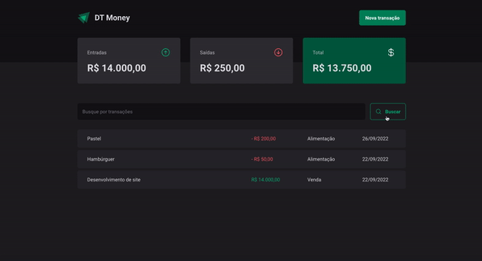

<h1 align='center'>
    
</h1>

<p align="center">Application for finances management built with ReactJS and Styled-Components</p>

<p align="center">
   <a href="https://github.com/gustavonobrega">
    
   </a>
</p>

<p align="center">
  
</p>

<hr />

## 🚀 Technologies

This project was developed with the following technologies:

- [ReactJS](https://reactjs.org/)
- [React Router Dom](https://reactrouter.com/)
- [TypeScript](https://www.typescriptlang.org/)
- [Styled-Components](https://styled-components.com/)
- [Radix](https://www.radix-ui.com/)
- [React Hook Form](https://react-hook-form.com/)
- [Zod](https://zod.dev/)
- [Phosphor Icons](https://phosphoricons.com/)
- [Axios](https://axios-http.com/ptbr/docs/intro)
- [JSON Server](https://github.com/typicode/json-server)
- [Use Context Selector](https://github.com/dai-shi/use-context-selector)
- [ESLint](https://eslint.org/)


## 💻  Getting started

```bash
# Clone this repository
$ git clone https://github.com/gustavonobrega/dtmoney

# Go into the repository
$ cd dtmoney

# Install dependencies
$ npm install

# Run the app
$ npm run dev:server
$ npm run dev
```

---

Made with ♥ by Gustavo Nobrega